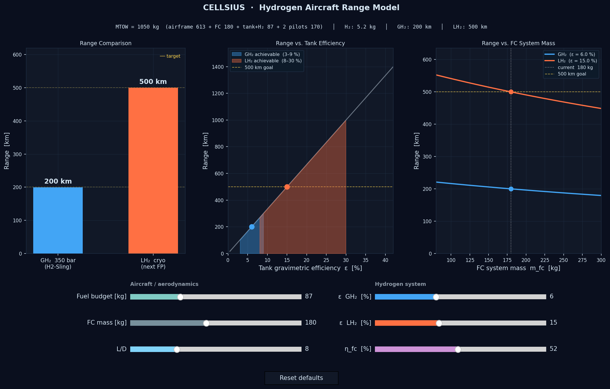

# CELLSIUS — Hydrogen Aircraft Range Model

An interactive range simulation for the CELLSIUS H2-Sling aircraft, comparing gaseous (350 bar) and liquid hydrogen storage as a function of tank efficiency, aerodynamic performance, and fuel-cell system mass.

Built as a design-space tool to understand what actually limits hydrogen aircraft range — and which parameters matter most.

---

## Demo



GH₂ (blue) represents the current H2-Sling at 350 bar. LH₂ (orange) shows the potential of a future cryogenic aircraft. Sliders let you explore how tank technology, fuel-cell mass, and aerodynamics shift the numbers in real time.

---

## The Engineering Problem

Getting a hydrogen aircraft to fly further than 200 km is harder than swapping in a bigger tank:

- The **tank dominates the weight budget** — at 350 bar, only ~6% of the tank+H₂ assembly is actual fuel. The rest is carbon-fibre pressure vessel.
- A **heavier fuel-cell stack** improves power output but adds directly to MTOW, consuming range it was meant to enable.
- **Liquid hydrogen** sidesteps the pressure vessel problem but demands cryogenic insulation at −253 °C and introduces boil-off and handling complexity.
- The **lift-to-drag ratio** of the airframe is arguably the single highest-leverage parameter — and it gets worse as the aircraft grows heavier to carry more hydrogen.

This simulation models each of those trade-offs and lets you explore their interactions.

---

## Physics

### Range equation

The model uses a Breguet-style energy-limited cruise range equation:

```
R = (E_elec / (m_ac · g)) · η_prop · (L/D)
```

| Symbol | Meaning |
|---|---|
| `E_elec` | Electrical energy delivered to the motor (computed in kWh, converted to J for SI range output) |
| `m_ac` | Total aircraft mass at take-off [kg] |
| `g` | Gravitational acceleration, 9.81 m/s² |
| `η_prop` | Motor × ESC × propeller efficiency — fixed at 0.79, not a slider |
| `L/D` | Lift-to-drag ratio |

### Energy chain

```
E_elec = m_H2 · LHV_H2 · η_fc        (LHV_H2 = 33.33 kWh/kg = 120 MJ/kg)
m_H2   = ε_grav · budget_fc
```

`ε_grav` is the **gravimetric tank efficiency** — the fraction of the total tank+fuel assembly that is actual hydrogen. This is the key differentiator between GH₂ and LH₂.

### Mass budget

```
m_ac = m_base + m_fc + budget_fc + m_payload
```

| Component | Default | Source |
|---|---|---|
| `m_base` | 613 kg | Airframe + 105 kW e-motor + prop + avionics |
| `m_fc` | 180 kg | FC stack + compressor + humidifier + cooling + DC/DC |
| `budget_fc` | 87 kg | Tank + H₂ (→ 5.2 kg H₂ at ε = 6%) |
| `m_payload` | 170 kg | 2 pilots |
| **MTOW** | **1050 kg** | **cellsius.aero** |

### Why the constant-mass approximation is valid here

Classical Breguet uses a logarithmic correction for the burn-down of fuel mass during cruise:

```
R = (L/D) · (η/g) · e_spec · ln(W_i / W_f)
```

For the CELLSIUS case, m_H₂ = 5.2 kg on a 1050 kg aircraft — a fuel fraction of 0.5%. The logarithmic correction adds less than 0.25% to the result. Even at maximum slider settings (ε = 35%, budget = 200 kg → m_H₂ ≈ 70 kg), the fuel fraction reaches ~6% and the error stays below 3%. The simpler linear form is sufficient across the full interactive range.

---

## The Two Cases

| | GH₂ 350 bar (H2-Sling) | LH₂ cryo (next FP) |
|---|---|---|
| Storage | Compressed gas, Type-IV CFRP tank | Liquid at −253 °C, insulated vessel |
| Tank efficiency ε | 3–9 % | 8–30 % |
| Default ε | 6 % | 15 % |
| H₂ loaded (at default) | 5.2 kg | 13.1 kg |
| Range (at default) | **200 km** | **500 km** |
| Maturity | Flying today | Focus project goal |

The shaded bands on the centre plot show the achievable efficiency window for each technology. The dots mark the current slider position.

---

## Sliders

### Aircraft / aerodynamics

| Slider | Range | Effect |
|---|---|---|
| **Fuel budget [kg]** | 40–200 kg | Total mass allocated to tank + H₂. More budget = more energy, but also more weight. Range increases with diminishing returns. |
| **FC mass [kg]** | 100–280 kg | Fuel-cell stack + balance-of-plant. Heavier FC adds to MTOW without adding fuel energy — range falls. |
| **L/D** | 5–16 | Aerodynamic efficiency. Range scales linearly with L/D — the highest-leverage single parameter in the model. |

### Hydrogen system

| Slider | Range | Effect |
|---|---|---|
| **ε GH₂ [%]** | 1–15 % | Gravimetric efficiency of the 350-bar tank. Realistic range: 3–9 %. |
| **ε LH₂ [%]** | 3–35 % | Gravimetric efficiency of the cryogenic vessel. Realistic range: 8–30 %. |
| **η_fc [%]** | 35–70 % | Fuel-cell system efficiency (LHV basis). 52 % is realistic for a modern PEM system. |

---

## The Three Plots

**Range Comparison** — Direct read-out of GH₂ vs LH₂ range at the current slider values. Yellow dashed lines mark the 200 km and 500 km targets.

**Range vs. Tank Efficiency** — Sweeps ε from 0 to 42 % with everything else held constant. The sweep deliberately extends beyond the slider caps (15%/35%) to show the asymptotic behaviour as tank technology matures. Shaded bands mark today's achievable windows for each technology.

**Range vs. FC System Mass** — Sweeps fuel-cell mass from 80 to 300 kg. The sweep extends slightly beyond the slider range (100–280 kg) to show the trend at the extremes. Range decreases as the stack gets heavier because MTOW rises while fuel energy stays fixed.

---

## Key Findings

**Tank efficiency is the primary lever.** Going from GH₂ at ε = 6% to LH₂ at ε = 15% more than doubles the range on an identical aircraft and fuel budget.

**Range scales linearly with L/D.** Improving from L/D = 8 to L/D = 16 doubles range — the same gain as doubling tank efficiency, but through aerodynamics rather than chemistry.

**Fuel-cell mass matters, but not dramatically.** Halving FC mass from 180 kg to 90 kg drops MTOW from 1050 to 960 kg, increasing range by ~9.4% (= 1050/960 − 1). Tank efficiency improvements produce much larger gains.

**Adding more fuel budget always helps — with diminishing returns.** Because hydrogen's energy density is so high, the energy gained from extra H₂ always outweighs the mass penalty of carrying it, even at low tank efficiency. The practical limit is airframe volume and structural weight margin, not physics.

---

## Calibration

Defaults are calibrated to published CELLSIUS specs from cellsius.aero:

```
MTOW    = 1050 kg  ✓
H₂ mass =  5.2 kg  ✓  (ε=6%, budget=87 kg → 5.22 kg)
Range   =  200 km  ✓  (L/D=8, η_prop=0.79, η_fc=52%)
```

---

## Installation

```bash
pip install matplotlib numpy
python cellsius_range_model.py
```

Requires Python 3.9+. On non-macOS systems, change line 2 of the script:

```python
matplotlib.use('MacOSX')   # change to 'Qt5Agg' or 'TkAgg' on Linux/Windows
```

---

## Limitations

| Assumption | Reality |
|---|---|
| Constant aircraft mass during cruise | Mass decreases as H₂ burns. Error < 0.25% for this aircraft — negligible. |
| No fuel reserve | Real VFR operations hold back ~15% of fuel. Subtract ~15% from displayed range for operational figures. |
| Fixed L/D | In reality L/D shifts with weight and speed. A heavier aircraft flies at a different point on the drag polar. |
| No power feasibility check | The model doesn't verify the FC can sustain cruise power. Valid here because defaults are calibrated to a flying aircraft. |
| Point-mass model | No aerodynamic drag breakdown, no attitude dynamics, no wind. |

The model is designed to capture the **energy and mass trade-offs** of hydrogen storage technology — not to be a flight performance simulator.

---

## Contributors

| | |
|---|---|
| **Jamie Trounce** | Physics modelling, calibration, UI design |
| **Claude (Anthropic)** | Co-development, code implementation, README |
